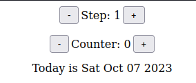

# Counter Days

Projeto construido no curso The Ultimate React Course 2023: React, Redux & More pelo instrutor Jonas Schmedtmann

[🔗 Clique aqui para acessar](https://mateusalmeida31415.github.io/counter/)

## 🛠 Tecnologias

- HTML
- CSS
- JSX
- Git e Github
- React

## Aprendizado

- Iniciar um projeto com create react app
- Criar e usar componentes
- Usar eventos
- Usar variaveis de estado e props
- Renderização condicional
- Usar a sintaxe do JSX
